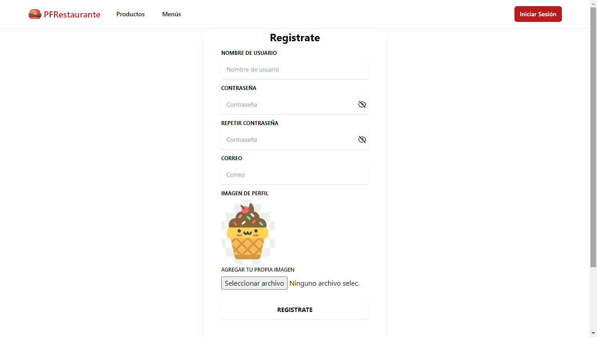
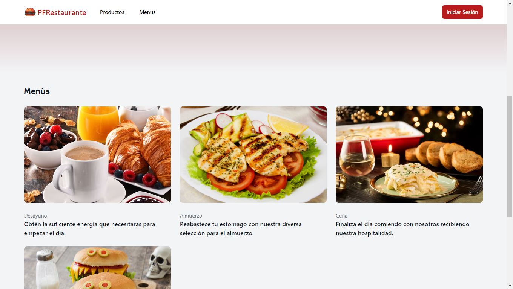
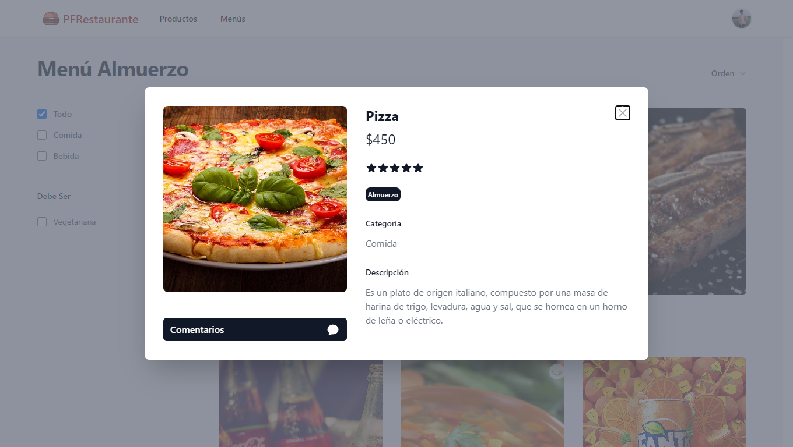
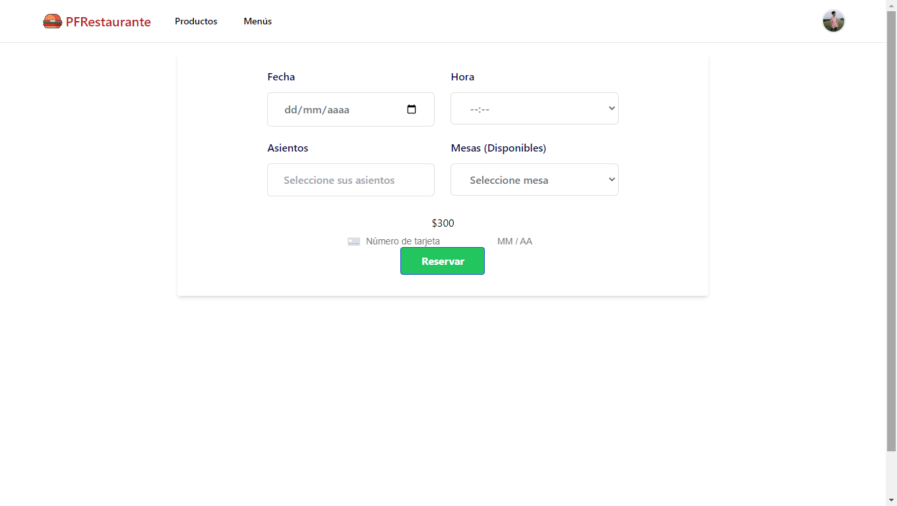
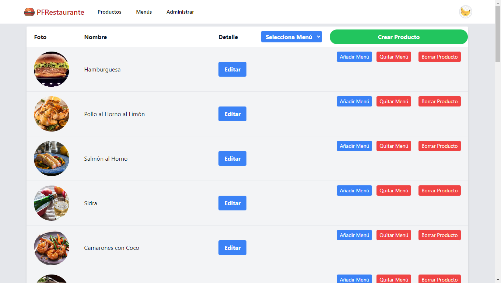

<h1 align="center">Hola 👋,yo soy Gabriel Nesteruk</h1>
<h3 align="center">Full stack developer de Córdoba, Argentina

- 👯 Puedes mirar mi trabajo en equipo en [PFRestaurante](https://github.com/kiliss/PF)

- 💬 Pregúntame por **React, Express, JavaScript**

:star: Languages and Tools:

  <code></code>
  <code></code>
  <code></code>
  <code></code>
  <code></code>
  <code></code>
  <code></code>
   
  <code></code>
  <code></code>
  <code></code>
  <code></code>
  <code></code>
  <code></code>
  <code>
   

 &nbsp;
 

    <h3 align="left">Algunas capturas de mi proyectos:</h3>
    
    
    
    
    

 How to reach me:

<a href="https://www.linkedin.com/in/gabriel-hector-cruz-nesteruk-14b784252/" > &nbsp;
<a href="mailto:nesteruk806@gmail.com" >

<!--
**nesteruk2135/nesteruk2135** is a ✨ _special_ ✨ repository because its `README.md` (this file) appears on your GitHub profile.

Here are some ideas to get you started:

- 🔭 I’m currently working on ...
- 🌱 I’m currently learning ...
- 👯 I’m looking to collaborate on ...
- 🤔 I’m looking for help with ...
- 💬 Ask me about ...
- 📫 How to reach me: ...
- 😄 Pronouns: ...
- ⚡ Fun fact: ...
-->
